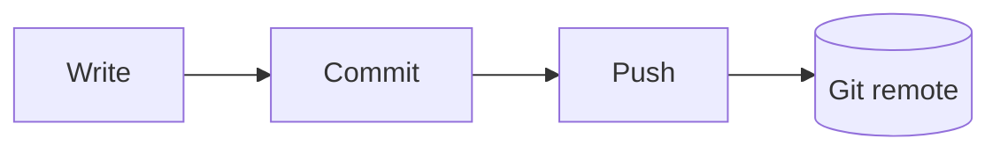
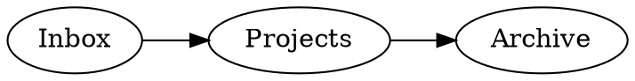

Open Note renders diagrams inline, from fenced code blocks that are still just
text in your Markdown file.

The rule is the same one the rest of the editor follows: **a block renders while
you are reading it and shows its source while you are editing it.** Put the caret
inside the fence and the code comes back; move it away and the picture returns.

## Mermaid

Preferred, because GitHub renders it too. A diagram you write here is a diagram
in your repository's web view, with no extra step.

````markdown

````

Flowcharts, sequence diagrams, state diagrams, ER diagrams, Gantt charts and
class diagrams all work.

:::note
Mermaid is configured with `htmlLabels: false`. Mermaid otherwise draws labels
inside `foreignObject`, which the sanitiser strips — silently blanking every
label on the diagram. Text labels look near-identical and always survive.
:::

## Graphviz DOT

For graphs Mermaid's layouts do not suit.

````markdown

````

DOT does **not** render on GitHub. It stays a fenced code block there, which is
readable but not drawn.

## Excalidraw

For anything freehand — a sketch, a rough box-and-arrow, a whiteboard photo
replacement.

Excalidraw drawings are `.excalidraw` files in the vault, opened on a canvas
rather than in the editor. They are stored as plain JSON, so they diff and merge
like any other file rather than arriving as an opaque blob in your history.

Embed one in a note with `![[sketch.excalidraw]]` and the drawing renders in
place, off the active line, opening the canvas when you click it.

GitHub shows the file itself as JSON.

## Rendered SVG is sanitised

A vault can be cloned from anywhere, and a diagram is code that produces markup.
Before any rendered SVG reaches the screen, Open Note strips:

- `<script>` elements
- event handler attributes (`onclick`, `onload`, and the rest)
- `javascript:` URLs
- `<foreignObject>`, which can carry arbitrary HTML

This is not optional and there is no setting to disable it.

## Which to choose

| | Renders in Open Note | Renders on GitHub | Good for |
|---|---|---|---|
| **Mermaid** | Yes | Yes | Almost everything |
| **Graphviz DOT** | Yes | No | Dense graphs, precise layout |
| **Excalidraw** | Yes | No | Sketches and freehand |

If you want the diagram to survive outside Open Note, use Mermaid.
